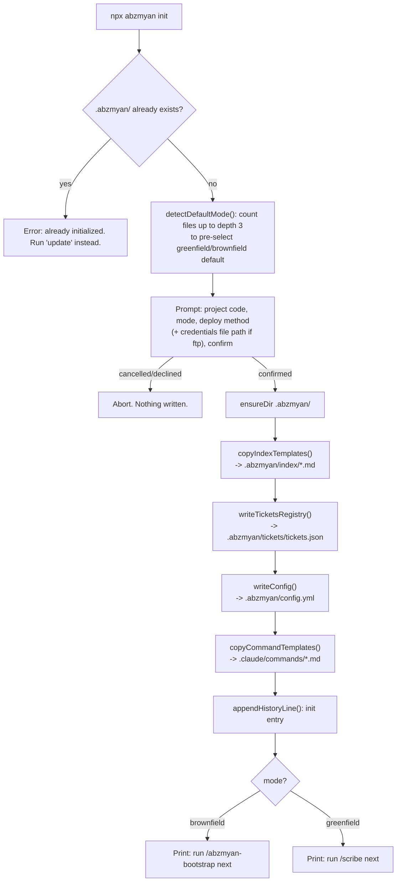
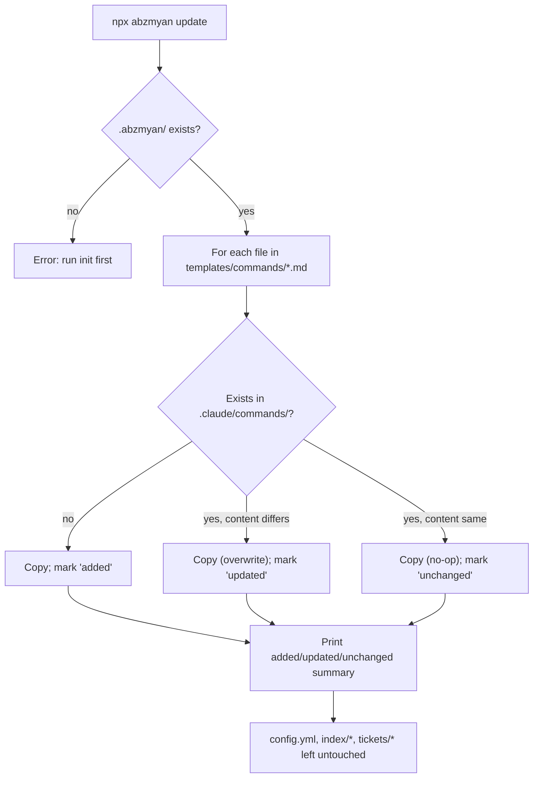
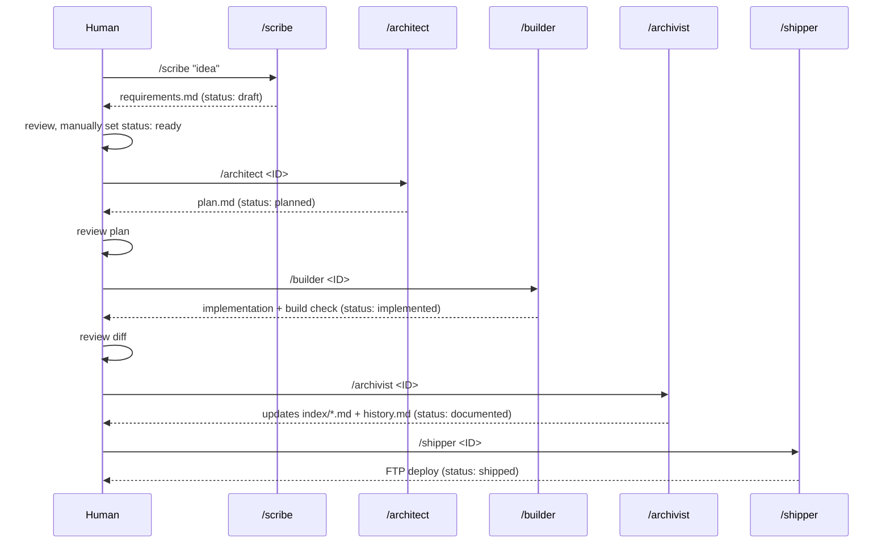
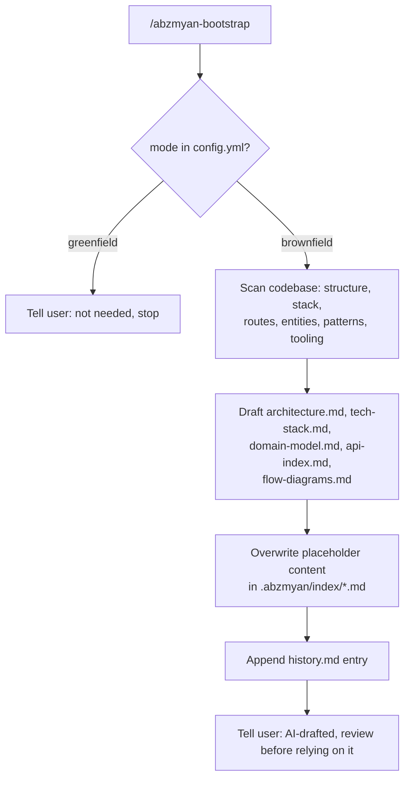

# Flow Diagrams

> Maintained by: Archivist agent. Current-state snapshot — edit in place.

## `npx abzmyan init` flow

## `npx abzmyan update` flow

## Per-ticket agent workflow (executes inside Claude Code, not this repo's code)

Each arrow above is a manually-triggered, separate Claude Code chat session — there is no auto-chaining; a human reviews output and triggers the next command.

## Bootstrapper flow (this agent, brownfield-only, one-time)

